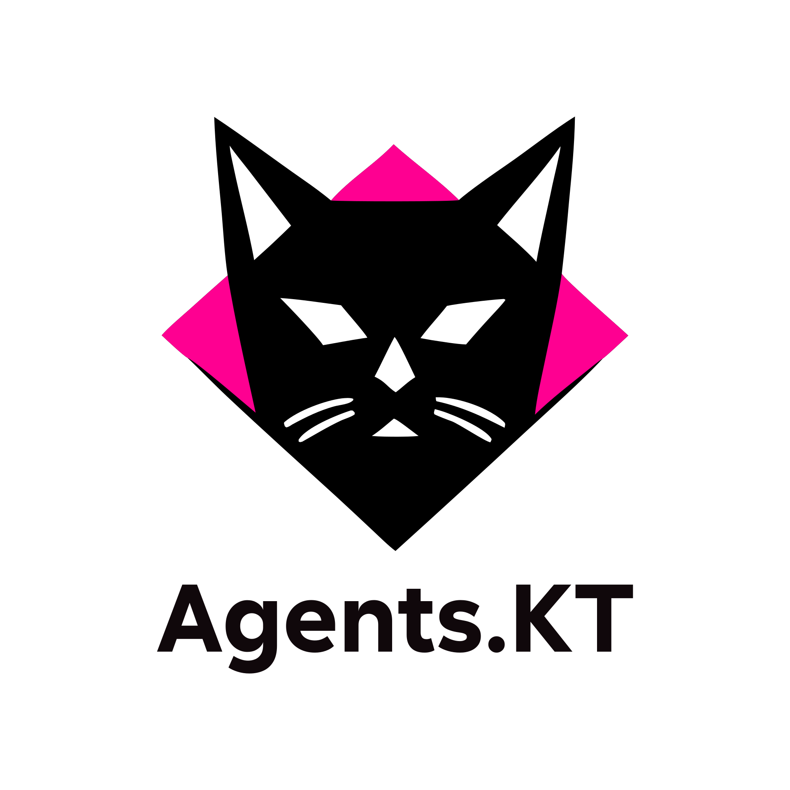

<p align="center">
  
</p>

<p align="center">
  <strong>Typed Kotlin DSL framework for AI agent systems.</strong><br/>
  <em>Define Freely. Compose Strictly. Ship Reliably.</em>
</p>

<p align="center">
  <a href="https://github.com/Deep-CodeAI/Agents.KT/actions/workflows/ci.yml"></a>
  <a href="https://central.sonatype.com/artifact/ai.deep-code/agents-kt"></a>
  <a href="https://kotlinlang.org"></a>
  <a href="https://openjdk.org"></a>
  <a href="LICENSE"></a>
</p>

---

Every agent is `Agent<IN, OUT>`. One input type, one output type, one job. Type mismatches and wrong compositions are caught by the compiler.  Reused agent instances are caught at construction time.

```kotlin
val parse = agent<RawText, Specification>("parse") {
    skills {
        skill<RawText, Specification>("parse-spec", "Splits raw text into a structured specification") {
            implementedBy { input -> Specification(input.text.split(",").map { it.trim() }) }
        }
    }
}
val generate = agent<Specification, CodeBundle>("generate") {
    skills {
        skill<Specification, CodeBundle>("gen-code", "Generates stub functions for each endpoint") {
            implementedBy { spec -> CodeBundle(spec.endpoints.joinToString("\n") { "fun $it() {}" }) }
        }
    }
}
val review = agent<CodeBundle, ReviewResult>("review") {
    skills {
        skill<CodeBundle, ReviewResult>("review-code", "Approves code if it is non-empty") {
            implementedBy { code -> ReviewResult(approved = code.source.isNotBlank()) }
        }
    }
}

// Compiler checks every boundary
val pipeline = parse then generate then review
// Pipeline<RawText, ReviewResult>

val result = pipeline(RawText("getUsers, createUser, deleteUser"))
// ReviewResult(approved=true)
```

---

## Why Agents.KT

Most agent frameworks let you wire anything to anything. Agents.KT says no.

| Problem | Agents.KT answer |
|---------|-----------------|
| God-agents with unlimited responsibilities | `Agent<IN, OUT>` — one type contract, compiler-enforced SRP |
| Runtime type mismatches between agents | `then` requires `A.OUT == B.IN` — compile error otherwise |
| The same agent instance wired into two places | Single-placement rule — `IllegalArgumentException` at construction time |
| LLM doesn't know which skill to use | `skillSelection {}` predicates or automatic LLM routing — descriptions sell each skill to the router |
| LLM doesn't know what context to load | `knowledge("key", "description") { }` entries — LLM reads descriptions before deciding to call |
| Flat pipelines only | Six composition operators covering sequential, parallel, iterative, branching, detached spawn, and multi-agent patterns |
| LLM output is an untyped string | `@Generable` + `@Guide` — `toLlmDescription()`, JSON Schema, prompt fragment, lenient deserializer, and `PartiallyGenerated<T>` via runtime reflection; KSP compile-time generation planned Phase 2 |
| MCP tools are wrappers, not first-class | `McpTool<IN, OUT>` inherits `Tool<IN, OUT>` — same interface as local tools, no adapters |
| Permission model is stringly-typed | `grants { tools(writeFile, compile) }` — actual `Tool<*,*>` references, compiler-validated |
| No testing story | AgentUnit — deterministic through semantic assertions *(planned)* |
| JVM frameworks require Java installed | Native CLI binary via GraalVM *(planned Phase 2 Priority)* |

---

## Skills

An agent is a container of typed skills. Each skill has its own `<IN, OUT>` and a mandatory `description`. At least one skill must produce the agent's `OUT` type — validated at construction.

```kotlin
val writeCode = skill<Specification, CodeBundle>("write-code",
    "Writes production Kotlin code from scratch based on a specification") {
    knowledge("style-guide", "Preferred coding style — immutability, naming, formatting") {
        "Prefer val over var. Use data classes for DTOs."
    }
    knowledge("examples", "Concrete input/output pairs for few-shot prompting") {
        loadExamples("code/greenfield-examples.kt")
    }
    implementedBy { spec -> CodeBundle(generate(spec)) }
}

val coder = agent<Specification, CodeBundle>("coder") {
    prompt("You are an expert Kotlin developer.")
    skills {
        +writeCode                                                          // pre-defined skill
        skill<String, String>("format-code", "Formats Kotlin source") { }  // inline utility skill
    }
}

// Call any skill directly — fully typed, no casts
writeCode.execute(mySpec)   // Specification → CodeBundle
```

### How a skill describes itself to the LLM

```kotlin
skill.toLlmDescription()   // auto-generated markdown — no extra annotations needed
skill.toLlmContext()        // full context: description + all knowledge content loaded
skill.knowledgeTools()      // tools model: knowledge as callable list the LLM pulls on demand
```

**`toLlmDescription()`** — convention-over-configuration. Auto-generated from what's already on the skill — name, types, description, and knowledge index. No `input()`, `output()`, or `rule()` calls needed. When `IN`/`OUT` types carry `@Generable`, their description and field list (with `@Guide` texts) are embedded inline:

```markdown
## Skill: write-code

**Input:** Specification — A structured API specification
  - endpoints (List<String>): List of endpoint paths to implement
**Output:** CodeBundle — A bundle of generated Kotlin source files
  - source (String): The generated Kotlin source code

Writes production Kotlin code from scratch.

**Knowledge:**
- style-guide — Preferred coding style — immutability, naming, formatting
- examples — Concrete input/output pairs for few-shot prompting
```

Override for the rare case where generated text isn't right:

```kotlin
skill<Specification, CodeBundle>("write-code", "...") {
    llmDescription("Custom markdown description")
}
```

**`toLlmContext()`** — everything pre-loaded before the LLM runs: `toLlmDescription()` followed by the full content of each knowledge entry:

```markdown
## Skill: write-code

**Input:** Specification — A structured API specification
  - endpoints (List<String>): List of endpoint paths to implement
**Output:** CodeBundle — A bundle of generated Kotlin source files
  - source (String): The generated Kotlin source code

Writes production Kotlin code from scratch.

**Knowledge:**
- style-guide — Preferred coding style — immutability, naming, formatting
- examples — Concrete input/output pairs for few-shot prompting

Knowledge:
--- style-guide ---
Prefer val over var. Use data classes for DTOs.
--- examples ---
...
```

**`knowledgeTools()`** — returns knowledge entries as a list of callable tools. In agentic skills (`tools(...)`), this is wired automatically — no extra configuration needed. The LLM sees knowledge entries listed alongside action tools and fetches them on demand; content is never loaded unless called:

```kotlin
data class KnowledgeTool(
    val name: String,
    val description: String,   // LLM reads this to decide whether to call
    val call: () -> String,    // lazy — loads only when invoked
)
```

| Mode | When | How |
|------|------|-----|
| Eager (`toLlmContext()`) | Non-agentic skills | All knowledge content dumped into system prompt upfront |
| Lazy (`knowledgeTools()`) | Agentic skills — **automatic** | Knowledge listed as tools; content loaded only when the LLM calls them |

### Shared Knowledge

Knowledge lambdas close over shared state. Multiple agents can reference the same data source — no special API needed. Since knowledge is lazy, every call sees the latest state.

```kotlin
// Shared data source — both agents read from the same map
val catalog = mapOf(
    "products" to """
        | ID  | Name              | Price | Category    | In Stock |
        |-----|-------------------|-------|-------------|----------|
        | P01 | Kotlin In Action  | 45    | Books       | yes      |
        | P02 | Mechanical KB     | 120   | Electronics | yes      |
        | P03 | Espresso Machine  | 299   | Appliances  | no       |
        | P04 | USB-C Hub         | 35    | Electronics | yes      |
        | P05 | Clean Code        | 40    | Books       | yes      |
    """.trimIndent(),
    "policies" to """
        - Only recommend products that are in stock.
        - Budget limit must be respected — never exceed it.
        - Prefer variety across categories when possible.
    """.trimIndent(),
)

val recommender = agent<String, String>("recommender") {
    prompt("Recommend 1-2 products by ID and name. Follow the policies.")
    model { ollama("gpt-oss:120b-cloud"); temperature = 0.0 }
    skills { skill<String, String>("recommend", "Recommend products from catalog") {
        tools()
        knowledge("products", "Full product catalog with prices and stock") { catalog["products"]!! }
        knowledge("policies", "Recommendation rules") { catalog["policies"]!! }
    }}
}

val validator = agent<String, String>("validator") {
    prompt("Verify recommendations: products exist, are in stock, within budget. Reply VALID or INVALID: reason.")
    model { ollama("gpt-oss:120b-cloud"); temperature = 0.0 }
    skills { skill<String, String>("validate", "Validate recommendations against catalog") {
        tools()
        knowledge("products", "Full product catalog with prices and stock") { catalog["products"]!! }
        knowledge("policies", "Recommendation rules") { catalog["policies"]!! }
    }}
}

val pipeline = recommender then validator
pipeline("I want electronics, budget 100 dollars")
// recommender picks P04 — USB-C Hub ($35, in stock)
// validator confirms: "VALID"
```

Both agents load the same catalog on demand via knowledge tool calls. The recommender picks products; the validator cross-checks them against the same source of truth.

---

## Model & Tool Calling

Attach a model to an agent and mark a skill as agentic with `tools(...)`. The framework runs a multi-turn loop — model calls tools, results flow back, model produces the final answer.

```kotlin
val calculator = agent<String, String>("calculator") {
    prompt("You are a calculator. Use the provided tools to evaluate expressions step by step.")
    model { ollama("gpt-oss:120b-cloud"); host = "localhost"; port = 11434; temperature = 0.0 }

    tools {
        tool("add",      "Add two numbers. Args: a, b")             { args -> num(args, "a") + num(args, "b") }
        tool("subtract", "Subtract b from a. Args: a, b")           { args -> num(args, "a") - num(args, "b") }
        tool("multiply", "Multiply two numbers. Args: a, b")        { args -> num(args, "a") * num(args, "b") }
        tool("divide",   "Divide a by b. Args: a, b")               { args -> num(args, "a") / num(args, "b") }
        tool("power",    "Raise base to exponent. Args: base, exp") { args -> Math.pow(num(args, "base"), num(args, "exp")) }
    }

    skills {
        skill<String, String>("solve", "Evaluate arithmetic expressions using tools") {
            tools("add", "subtract", "multiply", "divide", "power")
        }
    }

    onToolUse { name, args, result ->
        println("  $name(${args.values.joinToString(", ")}) = $result")
    }
}

calculator("Calculate ((15 + 35) / 2)^2")
//   add(15.0, 35.0) = 50.0
//   divide(50.0, 2.0) = 25.0
//   power(25.0, 2.0) = 625.0
// → "The result is 625."
```

**`model { }`** — configures the LLM backend. Currently supports Ollama; `host`, `port`, and `temperature` are settable.

**`tools { tool(name, description) { args -> } }`** — registers callable tools. Each tool receives a `Map<String, Any?>` of arguments and returns any value.

**`skill { tools(...) }`** — marks a skill as LLM-driven. The listed tool names are the ones the model may call. The model decides which tools to call and in what order.

**`onToolUse { name, args, result -> }`** — fires after every action tool execution. Useful for logging, tracing, and test assertions.

**`onKnowledgeUsed { name, content -> }`** — fires when the LLM fetches a knowledge entry. Receives the key name and loaded content. Does not fire for action tools.

**`onSkillChosen { name -> }`** — fires when the agent selects a skill to execute. Works with all routing strategies — predicate, LLM, and first-match.

```kotlin
val a = agent<String, String>("coder") {
    model { ollama("llama3") }
    skills { skill<String, String>("write", "Write Kotlin code") {
        tools()
        knowledge("style-guide", "Coding conventions") { loadFile("style.md") }
        knowledge("examples",    "Few-shot examples")  { loadFile("examples.kt") }
    }}
    onSkillChosen    { name          -> log("Skill: $name") }
    onKnowledgeUsed  { name, content -> log("Loaded: $name (${content.length} chars)") }
    onToolUse        { name, _, result -> log("Tool: $name = $result") }
}
// System prompt lists style-guide and examples as callable tools alongside action tools.
// Content is only fetched when the LLM decides it needs it.
```

### Skill Selection

When an agent has multiple skills with the same type signature, the framework decides which one to run. Three strategies, in priority order:

**1. Predicate routing** — deterministic, zero LLM cost:

```kotlin
val assistant = agent<String, String>("assistant") {
    model { ollama("llama3") }
    skills {
        skill<String, String>("upper", "Convert text to uppercase") {
            implementedBy { it.uppercase() }
        }
        skill<String, String>("lower", "Convert text to lowercase") {
            implementedBy { it.lowercase() }
        }
    }
    skillSelection { input ->
        if (input.startsWith("UP:")) "upper" else "lower"
    }
}

assistant("UP:hello")  // → "UP:HELLO"
assistant("HELLO")     // → "hello"
```

**2. LLM routing** — automatic when `model {}` is configured and multiple skills match. One cheap routing turn before the main agentic loop — the LLM reads all candidate `toLlmDescription()` outputs and picks a skill name:

```kotlin
val assistant = agent<String, String>("assistant") {
    model { ollama("gpt-oss:120b-cloud"); temperature = 0.0 }
    skills {
        skill<String, String>("summarize", "Summarize the given text into a brief summary") { tools() }
        skill<String, String>("translate-to-french", "Translate the given text to French") { tools() }
    }
    onSkillChosen { name -> println("Routed to: $name") }
}

assistant("Translate this to French: Hello world")
// Routed to: translate-to-french
// → "Bonjour le monde"
```

**3. First-match fallback** — when no predicate and no model, the first type-compatible skill wins (backward compatible).

| Condition | Strategy |
|-----------|----------|
| `skillSelection {}` set | Predicate — always wins |
| Multiple candidates + `model {}` | LLM routing turn |
| Single candidate | Direct — no routing needed |
| Multiple candidates, no model | First match |

---

**Typed output** — use `transformOutput { }` on a skill when the agent's `OUT` type isn't `String`:

```kotlin
val compute = agent<String, Int>("calculator") {
    model { ollama("gpt-oss:120b-cloud"); host = "localhost"; port = 11434; temperature = 0.0 }
    tools {
        tool("add",   "Add two numbers. Args: a, b")             { args -> num(args, "a") + num(args, "b") }
        tool("power", "Raise base to exponent. Args: base, exp") { args -> Math.pow(num(args, "base"), num(args, "exp")) }
    }
    skills { skill<String, Int>("solve", "Evaluate arithmetic expressions") {
        tools("add", "power")
        transformOutput { it.trim().toIntOrNull() ?: Regex("-?\\d+").find(it)?.value?.toInt() ?: error("No int in: $it") }
    }}
}

val result: Int = compute("Calculate 2^10")   // → 1024
```

**Budget control** — prevent runaway loops:

```kotlin
model { ollama("llama3") }
budget { maxTurns = 10 }   // throws BudgetExceededException after 10 turns
```

---

## Tool Error Recovery

Tools fail at runtime — network errors, timeouts, flaky APIs. Agents.KT lets each tool declare its own recovery strategy, and **the fixer is always an agent**. No special parser class, no lambda callbacks — a regular `Agent<String, String>` with the same composition, telemetry, and budget tracking as everything else. Deterministic agents (`implementedBy`) cost zero LLM calls.

### `onError` inside the tool block

Error handling lives where the tool lives:

```kotlin
tools {
    tool("fetch") {
        description("Fetch a URL")
        executor { args -> httpGet(args["url"].toString()) }
        onError {
            executionError { _ -> retry(maxAttempts = 3) }
        }
    }
}
// Tool throws → retries up to 3 times → succeeds or throws ToolExecutionException
```

Agent-based repair — the fixer is an `Agent<String, String>`:

```kotlin
val jsonFixer = agent<String, String>("json-fixer") {
    skills {
        skill<String, String>("cleanup", "Fixes common JSON issues") {
            implementedBy { input -> input.replace(",}", "}").replace(",]", "]") }
        }
    }
}

tools {
    tool("parse") {
        description("Parse JSON input")
        executor { args -> parseJson(args["json"].toString()) }
        onError {
            invalidArgs { _, _ -> fix(agent = jsonFixer) }
            executionError { _ -> fix(agent = jsonFixer, retries = 3) }
        }
    }
}
```

Shorthand form also works — `onError` as a named parameter:

```kotlin
tools {
    tool("fetch", "Fetch a URL", onError = {
        executionError { _ -> retry(maxAttempts = 3) }
    }) { args -> httpGet(args["url"].toString()) }
}
```

Or at the agent level via `onToolError`:

```kotlin
onToolError("fetch") {
    executionError { _ -> retry(maxAttempts = 3) }
}
```

### Defaults and priority

Set defaults once, override per tool:

```kotlin
tools {
    defaults {
        onError {
            executionError { _ -> retry(maxAttempts = 3) }
        }
    }
    tool("fetch", "Fetch URL") { _ -> httpGet() }      // inherits retry(3)
    tool("compile") {
        description("Compile code")
        executor { _ -> compile() }
        onError { executionError { _ -> retry(maxAttempts = 1) } }  // overrides
    }
}
```

Resolution priority: **tool block `onError`** > **agent-level `onToolError`** > **defaults**.

### Built-in tools: `escalate` and `throwException`

Every agent has two framework-provided tools — `escalate` and `throwException`. They exist in every agent's `toolMap` but are **inactive by default**. A skill activates them by referencing them in `tools(...)`:

```kotlin
val fixer = agent<String, String>("json-fixer") {
    prompt("Fix malformed JSON. If structural error, call escalate. If binary garbage, call throwException.")
    model { ollama("gpt-4o-mini"); temperature = 0.0 }
    skills {
        skill<String, String>("fix", "Fix JSON") {
            tools("escalate", "throwException")   // activates built-in tools
        }
    }
}
```

**`escalate`** — soft failure. The error is fed back to the parent LLM as a tool result, giving it a chance to retry with corrected arguments:

```
LLM calls parseJson(json = "{name: world}")  →  tool throws (unquoted keys)
  → fixer agent tries to fix
  → fixer LLM calls escalate(reason = "Unquoted keys. Corrected: {\"name\":\"world\"}")
    → error fed back to parent LLM: "ERROR: Tool 'parseJson' failed: Unquoted keys..."
      → parent LLM retries: parseJson(json = '{"name":"world"}')  →  succeeds
```

**`throwException`** — hard failure. `ToolExecutionException` propagates immediately through the pipeline. No retries.

Deterministic agents can also escalate by throwing directly:

```kotlin
implementedBy { _ ->
    throw EscalationException("Schema mismatch", Severity.HIGH)  // soft
    // or
    throw ToolExecutionException("Binary data, not JSON")         // hard
}
```

### Full example: JSON key counter with escalation recovery

A complete working example — agent parses malformed JSON via a tool, fixer agent escalates with corrected data, the LLM retries and succeeds:

```kotlin
// Fixer agent: LLM-driven, uses the built-in escalate tool.
// Analyzes the parse error and suggests corrected JSON in the escalation reason.
val fixer = agent<String, String>("json-fixer") {
    prompt(
        "You receive a string that failed to parse as JSON. " +
        "Call the escalate tool with a reason that includes the corrected valid JSON."
    )
    model { ollama("gpt-4o-mini"); temperature = 0.0 }
    budget { maxTurns = 3 }
    skills {
        skill<String, String>("fix", "Analyze and escalate JSON errors") {
            tools("escalate")   // activates the built-in escalate tool
        }
    }
}

// Main agent: uses calculateNumberOfKeys tool with onError inside the tool block.
val agent = agent<String, String>("json-analyst") {
    prompt(
        "Use the calculateNumberOfKeys tool to count keys in JSON objects. " +
        "If a tool returns an ERROR, read it carefully — it contains corrected JSON. " +
        "Retry the tool with the corrected JSON. Reply with ONLY the number."
    )
    model { ollama("llama3"); temperature = 0.0 }
    budget { maxTurns = 10 }
    tools {
        tool("calculateNumberOfKeys") {
            description("Count top-level keys in a JSON object. Args: json (valid JSON string)")
            executor { args ->
                val json = args["json"]?.toString()
                    ?: throw IllegalArgumentException("Missing 'json' argument")
                val keys = Regex(""""([^"]+)"\s*:""").findAll(json).toList()
                if (keys.isEmpty()) throw IllegalArgumentException("No valid keys — unquoted keys?")
                keys.size
            }
            onError {
                executionError { _ -> fix(agent = fixer, retries = 2) }
            }
        }
    }
    skills {
        skill<String, String>("solve", "Analyze JSON using tools") {
            tools("calculateNumberOfKeys")
        }
    }
    onToolUse { name, args, result ->
        println("  $name(${args["json"].toString().take(60)}) = $result")
    }
}

agent("How many keys? {name: world, age: 30, active: true}")
//   calculateNumberOfKeys({name: world, age: 30, active: true}) =
//       ERROR: Tool 'calculateNumberOfKeys' failed: No valid keys — unquoted keys? ...
//   calculateNumberOfKeys({"name":"world","age":30,"active":true}) = 3
// → "3"
```

The flow:
1. LLM calls `calculateNumberOfKeys(json="{name: world, ...}")` — malformed, unquoted keys
2. Tool throws → `onError` invokes `fixer` agent
3. Fixer LLM analyzes the error, calls `escalate(reason="...corrected: {\"name\":\"world\",...}")`
4. Escalation error fed back to main LLM as tool result
5. Main LLM reads the corrected JSON from the error, retries with valid JSON
6. Tool succeeds → returns `3`

### Error types

`ToolError` is a sealed hierarchy for programmatic handling:

```kotlin
sealed interface ToolError {
    data class InvalidArgs(val rawArgs: String, val parseError: String, ...)
    data class DeserializationError(val rawValue: String, val targetType: KType, ...)
    data class ExecutionError(val args: Map<String, Any?>, val cause: Throwable)
    data class EscalationError(val source: String, val reason: String, val severity: Severity, ...)
}
// Severity: LOW, MEDIUM, HIGH, CRITICAL
```

No tool has error handling by default. When no handler is set and a tool throws, the exception propagates normally — zero overhead on the happy path.

---

## Agent Memory

Memory persists across invocations — an agent accumulates knowledge over time rather than starting from zero each run. Pass a `MemoryBank` and three tools are auto-injected:

| Tool | Arguments | Returns |
|------|-----------|---------|
| `memory_read` | — | Full memory content |
| `memory_write` | `content` | Overwrites memory |
| `memory_search` | `query` | Lines matching the query (case-insensitive) |

```kotlin
val bank = MemoryBank(maxLines = 200)   // in-memory, optional line cap

val reviewer = agent<CodeDiff, ReviewResult>("reviewer") {
    memory(bank)
    model { ollama("llama3") }
    skills {
        skill<CodeDiff, ReviewResult>("review", "Reviews code changes") {
            tools()   // memory_read, memory_write, memory_search — all auto-available
            knowledge("memory-instructions") {
                "Before reviewing, call memory_read to check for known patterns. " +
                "After reviewing, call memory_write to save new patterns discovered."
            }
        }
    }
}
```

**Shared memory** — pass the same bank to multiple agents. Each agent reads/writes under its own name as key, so data is isolated by default but inspectable from the outside:

```kotlin
val shared = MemoryBank()
val analyst = agent<String, String>("analyst") { memory(shared); /* ... */ }
val writer  = agent<String, String>("writer")  { memory(shared); /* ... */ }

// After runs, inspect what each agent learned:
shared.read("analyst")   // analyst's memory
shared.read("writer")    // writer's memory
shared.entries()          // all keys
```

**Pre-seeding** — load initial knowledge before the first run:

```kotlin
val bank = MemoryBank()
bank.write("reviewer", "Known pattern: prefer val over var\nKnown pattern: avoid nullable returns")
```

**Fibonacci — the canonical memory test.** A single agent, no custom tools — just `memory_read`, `memory_write`, and a system prompt that teaches it the algorithm. Each call reads state, computes the next number, writes back, and returns the result:

```kotlin
val bank = MemoryBank()

val fib = agent<String, Int>("fibonacci") {
    prompt("""You maintain a Fibonacci sequence in memory.
Memory format: "prev|curr". Empty memory means start fresh.

1. Call memory_read
2. If empty → answer=1, write "0|1"
   If "A|B" → answer=A+B, write "B|A+B"
3. Call memory_write with the new state
4. Reply with ONLY the answer number""")
    memory(bank)
    model { ollama("llama3"); temperature = 0.0 }
    skills { skill<String, Int>("fib", "Generate next Fibonacci number") {
        tools()   // memory tools are auto-available
        transformOutput { it.trim().toInt() }
    }}
}

fib("do it")  // → 1   (bank: "0|1")
fib("do it")  // → 1   (bank: "1|1")
fib("do it")  // → 2   (bank: "1|2")
fib("do it")  // → 3   (bank: "2|3")
fib("do it")  // → 5   (bank: "3|5")

// Pre-seed to resume from any point:
bank.write("fibonacci", "21|34")
fib("do it")  // → 55  (bank: "34|55")
```

Memory is optional. Short-lived pipeline stages (parsers, formatters) are stateless. Memory is for agents that improve with experience: reviewers, planners, domain experts.

---

## Guided Generation

Agent inputs and outputs are data classes. `@Generable` + `@Guide` make them LLM-parseable — no manual schema authoring, no runtime boilerplate.

```kotlin
@Generable("Overall quality assessment of a code review")
data class ReviewResult(
    @Guide("Overall score from 0.0 to 1.0. Strict: < 0.6 means fail.")
    val score: Double,
    @Guide("One-sentence verdict: 'approved', 'needs revision', or 'rejected'.")
    val verdict: String,
    @Guide("Ordered list of specific issues found, or empty if approved.")
    val issues: List<String>,
)
```

**Three annotations:**

- **`@Generable("description")`** — marks the class as an LLM generation target. The optional description appears in auto-generated skill and type documentation.
- **`@Guide("description")`** — per-field (or per sealed variant) guidance for the LLM: range, format, constraints.
- **`@LlmDescription("...")`** — overrides the auto-generated `toLlmDescription()` verbatim for the rare case where the generated text doesn't fit.

Five artifacts are available at runtime via reflection:

| Artifact | API | Use |
|----------|-----|-----|
| LLM description | `ReviewResult::class.toLlmDescription()` | Convention-over-configuration markdown: class name, description, fields, types, `@Guide` texts |
| JSON Schema | `ReviewResult::class.jsonSchema()` | Constrained decoding (Ollama) or JSON mode (Anthropic) |
| Prompt fragment | `ReviewResult::class.promptFragment()` | Injected into system prompt automatically |
| Lenient deserializer | `fromLlmOutput<ReviewResult>(String)` | Parses partial/malformed LLM output; `null` on unrecoverable input |
| Streaming variant | `PartiallyGenerated<ReviewResult>` | Immutable accumulator; `withField()` returns a new copy as tokens arrive |

**`toLlmDescription()`** — auto-generated markdown, no extra work needed:

```markdown
## ReviewResult

Overall quality assessment of a code review

- **score** (Double): Overall score from 0.0 to 1.0. Strict: < 0.6 means fail.
- **verdict** (String): One-sentence verdict: 'approved', 'needs revision', or 'rejected'.
- **issues** (List<String>): Ordered list of specific issues found, or empty if approved.
```

When a skill's `IN`/`OUT` type carries `@Generable`, `Skill.toLlmDescription()` embeds the type shape inline — the LLM sees field names, types, and `@Guide` texts without any extra configuration.

**Two enforcement tiers — chosen at runtime based on the configured model:**

| Tier | Models | How |
|------|--------|-----|
| **Constrained** | Ollama, llama.cpp, vLLM | Grammar-constrained decoding — always valid JSON |
| **Guided** | Anthropic, OpenAI, Gemini | JSON mode + prompt fragment + lenient parse + fallback |

**Sealed types** — `@Guide` on each variant tells the LLM when to use it:

```kotlin
@Generable
sealed interface ReviewDecision {
    @Guide("Use when code passes all checks")
    data class Approved(val score: Double) : ReviewDecision

    @Guide("Use when code has fixable issues — list them in order of severity")
    data class NeedsRevision(
        @Guide("Specific issues, most critical first")
        val issues: List<String>
    ) : ReviewDecision

    @Guide("Use when fundamental design must change before any fix applies")
    data class Rejected(val reason: String) : ReviewDecision
}
```

The lenient deserializer routes to the correct subtype via the `"type"` discriminator. `.branch {}` receives exhaustively matched variants — no boilerplate.

**Streaming:**

```kotlin
val stream: Flow<PartiallyGenerated<ReviewResult>> = reviewer.stream(code)
stream.collect { partial ->
    partial.verdict?.let { showVerdict(it) }   // non-null = field has arrived
    partial.score?.let   { updateScore(it) }
}
```

---

## Composition Operators

### `then` — Sequential Pipeline

```kotlin
val pipeline = specMaster then coder then reviewer
// Pipeline<TaskRequest, ReviewResult>

val full = (specMaster then coder) then (reviewer then deployer)
```

### `/` — Parallel Fan-Out

All agents receive the same input concurrently via coroutines. The next stage receives `List<OUT>`.

```kotlin
val parallel = securityReview / styleReview / performanceReview
// Parallel<CodeBundle, Review>

val synthesizer = agent<List<Review>, Report>("synthesizer") {
    skills {
        skill<List<Review>, Report>("merge", "Merges all review results into a single report") {
            implementedBy { reviews ->
                Report(passed = reviews.all { it.passed }, summary = reviews.joinToString("\n") { it.summary })
            }
        }
    }
}

val pipeline = coder then parallel then synthesizer
// Pipeline<Specification, Report>
```

**Liskov:** declare agents as the common supertype — subtypes flow through transparently.

```kotlin
sealed interface Review
data class QuickReview(val summary: String)                        : Review
data class DeepReview(val issues: List<String>, val score: Double) : Review

val quick = agent<CodeBundle, Review>("quick") { skills { skill<CodeBundle, Review>("q", "Quick scan") { implementedBy { QuickReview(briefScan(it)) } } } }
val deep  = agent<CodeBundle, Review>("deep")  { skills { skill<CodeBundle, Review>("d", "Deep scan") { implementedBy { DeepReview(fullScan(it), score(it)) } } } }

val pipeline = (quick / deep) then synthesizer
// Pipeline<CodeBundle, Report>
```

### `*` — Forum (Multi-Agent Discussion)

Think *jury deliberation* — the case lands on the table, agents discuss across rounds, the last agent (foreperson) delivers the verdict. Agents see each other's reasoning; parallel agents do not.

```kotlin
val forum = initiator * analyst * critic * captain
// Forum<Specs, Decision>

val pipeline = inputConverter then forum then formatter
// Pipeline<Input, FormattedDecision>
```

### `.loop {}` — Iterative Execution

The block receives the output and returns the next input to continue, or `null` to stop. Fully composable.

```kotlin
val refineLoop = refine.loop { result -> if (result.score >= 90) null else result }

val qualityLoop = (generate then evaluate).loop { result ->
    if (result.quality >= 90f) null else result.spec
}

val pipeline = prepare then qualityLoop then publish
```

**Quality gate with `while`** — agents and pipelines are plain callable functions; standard Kotlin control flow works without any DSL:

```kotlin
var specs   = SpecsParcel(description = "build a user API")
var quality = 0f
while (quality < 90f) {
    specs   = specPipeline(specs)
    quality = specsEvaluator(specs)
}
```

### `.branch {}` — Conditional Routing on Sealed Types

Routes the output of an agent to a different handler per sealed variant. All branches must produce the same `OUT` type. Unhandled variants throw at invocation.

```kotlin
sealed interface ReviewResult
data class Passed(val score: Double)           : ReviewResult
data class Failed(val issues: List<String>)    : ReviewResult
data class NeedsRevision(val feedback: String) : ReviewResult

val afterReview = reviewer.branch {
    on<Passed>()        then deployer
    on<Failed>()        then failReporter
    on<NeedsRevision>() then (reviser then reviewer)  // pipeline on a variant
}
// Branch<CodeBundle, Report>

val pipeline = coder then afterReview then notifier
// Pipeline<Specification, Notification>
```

---

## Single-Placement Rule

Each `agent<>()` call is an instance. An instance can only be placed in one structure, ever.

```kotlin
val a = agent<A, B>("a") {}
val b = agent<B, C>("b") {}

a then b  // ✅ "a" placed in pipeline

a then c  // ❌ IllegalArgumentException:
          //    Agent "a" is already placed in pipeline.
          //    Create a new instance for "pipeline".

a * forum // ❌ same instance, different structure — also caught
```

---

## Type Algebra

```
Agent<A, B>    : A → B
A then B       : Agent<X,Y> then Agent<Y,Z>    → Pipeline<X,Z>
A / B          : Agent<X,Y> / Agent<X,Y>       → Parallel<X,Y>  →  List<Y> to next
A * B          : Agent<X,Y> * Agent<*,Z>       → Forum<X,Z>
A.loop { }     : (Pipeline<X,Y> | Agent<X,Y>)  → Loop<X,Y>   (null = stop, X = continue)
A.branch { }   : Agent<X, Sealed<Y>)           → Branch<X,Z>  (all variants → same Z)
```

---

## Getting Started

**Requirements:** JDK 21+, Kotlin 2.x, Gradle

```kotlin
// build.gradle.kts
dependencies {
    implementation("ai.deep-code:agents-kt:0.1.1")
}
```

Or clone and build from source:

```bash
git clone https://github.com/Deep-CodeAI/Agents.KT.git
cd Agents.KT
./gradlew test
```

---

## Roadmap

**Phase 1 — Core DSL** *(in progress)*
- [x] `Agent<IN, OUT>` with SRP enforcement
- [x] `Agent.prompt` — base context string for the LLM
- [x] Skills-only execution — all agents run through `skills { implementedBy { } }`
- [x] `Skill.description` (mandatory) — sells the skill to the LLM alongside its type signature
- [x] `Skill.knowledge("key", "description") { }` — named lazy context providers; `loadFile()` inside lambdas
- [x] `Skill.toLlmDescription()` — auto-generated markdown (name, types, description, knowledge index); `llmDescription("...")` override
- [x] `Skill.toLlmContext()` — full context: description markdown + all knowledge content
- [x] `Skill.knowledgeTools()` / `KnowledgeTool(name, description, call)` — tools model with lazy per-entry loading
- [x] `then` — sequential pipeline with composed execution (no runtime casts)
- [x] `/` — parallel fan-out with coroutine concurrency
- [x] `*` — forum (multi-agent discussion)
- [x] Single-placement enforcement across all structure types
- [x] `.loop {}` — iterative execution with `(OUT) -> IN?` feedback block
- [x] `.branch {}` — conditional routing on sealed types, composable with `then`
- [x] `@Generable("desc")` / `@Guide` / `@LlmDescription` — runtime reflection: `toLlmDescription()`, `jsonSchema()`, `promptFragment()`, `fromLlmOutput<T>()`, `PartiallyGenerated<T>`
- [x] `model { }` — Ollama backend; `host`, `port`, `temperature`; injectable `ModelClient` for tests
- [x] Agentic execution loop — multi-turn tool calling with budget controls (`maxTurns`) + `onToolUse` observability hook
- [x] Skill selection — predicate-based `skillSelection {}` + automatic LLM routing when multiple skills match
- [ ] `>>` — security/education wrap

**Phase 2 — Runtime + Distribution** *(Q2 2026)*

*Priority:*
- [ ] `Tool<IN, OUT>` hierarchy + `McpTool<IN, OUT>` — MCP as native Tool inheritance, not a wrapper
- [ ] MCP client integration — `McpTool` instances consumable alongside local tools
- [ ] `grants { tools(...) }` — Layer 2 permissions use actual `Tool<*,*>` references
- [ ] Permission model: 3 states — Granted (auto-runs), Confirmed (user approval), Absent (unavailable)
- [ ] KSP annotation processor — compile-time `@Generable`; constrained decoding (Ollama) + guided JSON mode (Anthropic/OpenAI)
- [ ] Native CLI binary (GraalVM — no JRE required); `brew`, npm, pip, curl, apt
- [ ] jlink minimal JRE bundle for runtime (~35MB)

*Secondary:*
- [ ] Session model — multi-turn `AgentSession`, automatic compaction (`SUMMARIZE`, `SLIDING_WINDOW`, `CUSTOM`)
- [ ] Reactive context hooks — `beforeInference`, `afterToolCall`, `onBudgetThreshold`
- [x] Agent memory — `MemoryBank`, `memory_read`/`memory_write`/`memory_search` auto-injected tools
- [ ] `.spawn {}` — independent sub-agent lifecycle, `AgentHandle<OUT>`, parent-managed join
- [ ] Pipeline observability — `observe {}` event handler, `Flow<PipelineEvent>` for streaming UIs
- [ ] Serialization — `agent.json`, A2A AgentCard
- [ ] JAR bundles and folder-based assembly
- [ ] Gradle plugin

**Phase 3 — Production** *(Q3 2026)*
- [ ] Layer 2: Full Structure DSL with delegates, grants, authority, routing, escalation
- [ ] All 37 compile-time validations enforced by Gradle plugin
- [ ] AgentUnit testing framework — unit, semantic (LLM-as-judge), Skill Coverage metrics
- [ ] A2A protocol support (server + client)
- [ ] File-based knowledge: `skill.md`, `reference`, `examples`, `checklist` + RAG pipeline
- [ ] Production observability: OpenTelemetry traces
- [ ] Team DSL — swarm coordination (if isolated execution available)

**Phase 4 — Ecosystem** *(Q4 2026)*
- [ ] Knowledge packs — battle-tested prompt libraries for common domains
- [ ] Agent generation from natural language (NL → Kotlin DSL)
- [ ] Skillify — extract reusable skills from session transcripts
- [ ] Visual structure editor, UML bidirectional conversion
- [ ] Knowledge marketplace

---

## License

[MIT](LICENSE) — K.Skobeltsyn Studio
