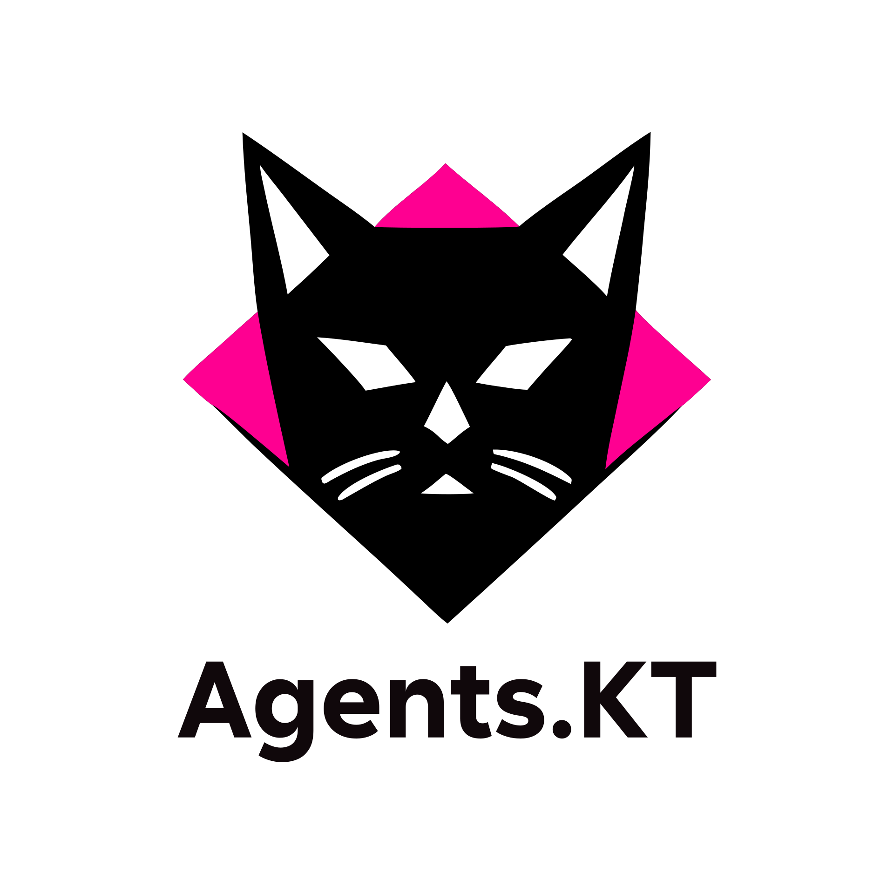

<p align="center">
  
</p>

<p align="center">
  <strong>Typed Kotlin DSL framework for AI agent systems.</strong><br/>
  <em>Define Freely. Compose Strictly. Ship Reliably.</em>
</p>

<p align="center">
  <a href="https://github.com/Deep-CodeAI/Agents.KT/actions/workflows/ci.yml"></a>
  <a href="https://central.sonatype.com/artifact/ai.deep-code/agents-kt"></a>
  <a href="https://kotlinlang.org"></a>
  <a href="https://openjdk.org"></a>
  <a href="LICENSE"></a>
</p>

---

Every agent is `Agent<IN, OUT>`. One input type, one output type, one job. Type mismatches and wrong compositions are caught by the compiler where composition is purely type-driven, and structural misuses fail fast at construction time. Reused agent instances are caught at construction time.

```kotlin
val parse = agent<RawText, Specification>("parse") {
    skills {
        skill<RawText, Specification>("parse-spec", "Splits raw text into a structured specification") {
            implementedBy { input -> Specification(input.text.split(",").map { it.trim() }) }
        }
    }
}
val generate = agent<Specification, CodeBundle>("generate") {
    skills {
        skill<Specification, CodeBundle>("gen-code", "Generates stub functions for each endpoint") {
            implementedBy { spec -> CodeBundle(spec.endpoints.joinToString("\n") { "fun $it() {}" }) }
        }
    }
}
val review = agent<CodeBundle, ReviewResult>("review") {
    skills {
        skill<CodeBundle, ReviewResult>("review-code", "Approves code if it is non-empty") {
            implementedBy { code -> ReviewResult(approved = code.source.isNotBlank()) }
        }
    }
}

// Compiler checks every boundary
val pipeline = parse then generate then review
// Pipeline<RawText, ReviewResult>

val result = pipeline(RawText("getUsers, createUser, deleteUser"))
// ReviewResult(approved=true)
```

---

## Why Agents.KT

Most agent frameworks let you wire anything to anything. Agents.KT says no.

| Problem | Agents.KT answer |
|---------|-----------------|
| God-agents with unlimited responsibilities | `Agent<IN, OUT>` — one type contract, compiler-enforced SRP |
| Runtime type mismatches between agents | `then` requires `A.OUT == B.IN` — compile error otherwise |
| The same agent instance wired into two places | Single-placement rule — `IllegalArgumentException` at construction time |
| LLM doesn't know which skill to use | Manual `skillSelection {}` routing or automatic LLM routing — descriptions sell each skill to the router |
| LLM doesn't know what context to load | `knowledge("key", "description") { }` entries — LLM reads descriptions before deciding to call |
| Flat pipelines only | Composition operators covering sequential, forum, parallel, iterative, and branching patterns |
| LLM output is an untyped string | `@Generable` + `@Guide` — `toLlmDescription()`, JSON Schema, prompt fragment, lenient deserializer, and `PartiallyGenerated<T>` via runtime reflection; KSP compile-time generation planned Phase 2 |
| MCP tools are wrappers, not first-class | `mcp { server() }` agent DSL — three transports (HTTP/stdio/TCP), auth, namespacing; agents can also be exposed as MCP servers via `McpServer.from(agent)` |
| Permission model is stringly-typed | `grants { tools(writeFile, compile) }` — actual `Tool<*,*>` references, compiler-validated *(planned Phase 2)* |
| No testing story | AgentUnit — deterministic through semantic assertions *(planned)* |
| JVM frameworks require Java installed | Native CLI binary via GraalVM *(planned Phase 2 Priority)* |

---

## What's in the Box

The README is long. This section is the index — every claim below points to working code in `main`, with the issue number that established it. Anything not in this section but visible elsewhere in the README is either *(planned)* with that suffix, or lives under [Roadmap](#roadmap).

### Implemented today

These APIs work in `main`, are unit-tested, and are exercised by integration tests (`./gradlew test` for default suite, `./gradlew integrationTest` for live-LLM):

- **Typed agents** — `Agent<IN, OUT>` with at least one skill producing `OUT`, validated at construction. See [Skills](#skills).
- **Skills with knowledge** — `skill { knowledge("key", "...") { } }`, lazy-loaded per call. See [Shared Knowledge](#shared-knowledge).
- **Agentic loop with tool calling** — multi-turn `chat ↔ tools` driven by the model. See [Model & Tool Calling](#model--tool-calling).
- **Typed tools via `@Generable`** — `tool<Args, Result>(...)` with reflection-built JSON Schema; `additionalProperties: false`; sealed-discriminator validation (#658, #661, #699).
- **Per-skill tool authorization** — runtime allowlist; the prompt's "Available tools" listing is descriptive, the security boundary is the runtime check (#630). See [Tool authorization model](#tool-authorization-model).
- **Inline tool-call fallback** — auto-recovery when an Ollama model rejects native `tools` (e.g. `gemma3:4b`) — strips the field, injects inline JSON format prompt, retries (#702, #706). See [Inline tool-call fallback](#inline-tool-call-fallback-ollama-models-without-native-tool-support).
- **Composition operators** — `then`, `/` (parallel), `*` and `forum { }` (multi-agent), `.loop {}`, `.branch {}` on sealed types. See [Composition Operators](#composition-operators).
- **Single-placement rule** — each `Agent` instance participates in at most one structure; second placement throws at construction. See [Single-Placement Rule](#single-placement-rule).
- **Memory bank** — `memory(MemoryBank())` auto-injects `memory_read` / `memory_write` / `memory_search` tools. See [Agent Memory](#agent-memory).
- **LLM skill routing** — manual `skillSelection { }` or LLM router with `skillSelectionConfidenceThreshold`; `SkillRoute(name, confidence, rationale)` is structured (#641). See [Skill Selection](#skill-selection).
- **Tool error recovery** — per-tool `onError`, per-skill default, agent default; built-in `escalate` and `throwException` agents. See [Tool Error Recovery](#tool-error-recovery).
- **Budget controls** — `budget { maxTurns; maxToolCalls; maxDuration; perToolTimeout; maxTokens }` (sacrificial-thread enforcement; token counts cumulative across turns when the provider reports usage) (#637, #963).
- **MCP client** — `mcp { server() }` over HTTP / stdio / TCP; Bearer auth; namespaced tools (`server.tool`). See [MCP Integration](#mcp-integration).
- **MCP server** — `McpServer.from(agent)` exposes an agent as an MCP-conformant server with explicit `tools/listChanged: false` capability (#619).
- **`McpRunner` standalone** — picocli-style one-liner main for shipping agents as MCP services.
- **Frozen-after-construction agents** — structural mutators (skills, tools, memory, model, budget, prompt, error handlers, routing) reject post-construction calls (#697, #708).
- **Encapsulated tool/skill maps** — `Agent.toolMap` and `Agent.skills` are read-only `Map` views; mutation only via DSL or framework-internal escape hatches (#659, #667).
- **`LlmProviderException`** — provider-boundary errors (auth, model-not-found, capability mismatch) surface distinctly from output-parse errors (#702).
- **Untrusted tool-output wrapping** — tool results carry an envelope so the model can't impersonate framework messages (#642).

### Experimental

APIs that exist in `main` and have tests, but haven't been exercised in production and may evolve based on real-world usage:

- **Forum with `transcriptCaptain`** — captain receives the full `ForumTranscript<IN>` (all participant outputs) instead of only the original input (#639). Useful for synthesis patterns; semantics may sharpen with usage.
- **Branch on sealed hierarchies** — `BranchRoute` sealed type with `onNull` / `onElse` markers and construction-time completeness validation (#640). Stable surface, limited real-world coverage.

### Security model

What the framework enforces today:

| Boundary | Enforcement | Established by |
|----------|-------------|----------------|
| Tool authorization | Runtime per-skill allowlist; unknown calls rejected — prompt is descriptive only | #630 |
| Tool name typos | Fail-fast at agent construction | #631 |
| Reserved memory names | `memory_read` / `memory_write` / `memory_search` cannot be shadowed by user tools | #659 |
| Agent contract | Skills, tools, memory, model, budget, prompt frozen after `agent { }` returns | #697, #708 |
| Typed args | `additionalProperties: false`; sealed `type` discriminator must match constructed variant | #661, #699 |
| Repaired args | Re-validated through the typed schema before reaching the executor | #658 |
| Tool output trust | Tool results wrapped in untrusted envelope so the model can't forge framework messages | #642 |
| Provider errors | Surface as `LlmProviderException` — never confused with model output | #702 |
| Budget caps | `maxTurns`, `maxToolCalls`, `maxDuration`, `perToolTimeout`, `maxTokens` (sacrificial-thread enforced; token cap is cumulative across turns when provider reports usage) | #637, #963 |

What the framework does **not** enforce — your responsibility:

- **Prompt-injection content filtering** — assumes you trust your inputs and system prompts.
- **Sandboxing of tool executors** — tool code runs in-process with full JVM permissions; sandbox at the OS / container layer if the tools execute untrusted plans.
- **Resource limits beyond budgets** — no automatic memory, file-descriptor, or network quotas.
- **Authentication on `McpServer`** — incoming MCP requests are not credential-checked yet (see Known Limitations).

### Known limitations

- **Single LLM provider** — Ollama only. The injectable `ModelClient` covers test stubs and custom adapters; native multi-provider (Anthropic, OpenAI, Google) is Phase 2.
- **Synchronous agentic loop** — `runBlocking` inside the loop until the suspend refactor lands (#638). Calling agents from existing coroutine scopes works but doesn't propagate cancellation cleanly.
- **No incoming auth on `McpServer`** — outgoing client supports Bearer; the server does not validate credentials. Suitable for trusted-network deployments only.
- **No Origin header validation on MCP HTTP** — deferred until the MCP-server hardening pass.
- **Runtime reflection for `@Generable`** — KSP compile-time generation is Phase 2. Today's path uses reflection at first-use; cost is amortized but not zero.
- **No streaming** — `chat()` returns a complete `LlmResponse`; `Flow<...>` streaming is on the Phase 2 roadmap.
- **No native binary** — JVM-only (≥ JDK 21). GraalVM and `jlink` bundles are Phase 2 priorities.
- **No A2A protocol yet** — agent-to-agent over network (Phase 2 / 3).
- **Inline-tool-call fallback model variance** — small Ollama models (e.g. `gemma3:4b`) reliably emit single tool calls via the inline format but may produce thin final-turn text after multi-step tool sequences. For multi-step reasoning, a tool-native model (`gpt-oss:20b-cloud` and similar) is the better fit.

For planned features beyond these limitations, see [Roadmap](#roadmap).

---

## Skills

An agent is a container of typed skills. Each skill has its own `<IN, OUT>` and a `description` used for docs and LLM routing. At least one skill must produce the agent's `OUT` type — validated at construction.

```kotlin
val writeCode = skill<Specification, CodeBundle>("write-code",
    "Writes production Kotlin code from scratch based on a specification") {
    knowledge("style-guide", "Preferred coding style — immutability, naming, formatting") {
        "Prefer val over var. Use data classes for DTOs."
    }
    knowledge("examples", "Concrete input/output pairs for few-shot prompting") {
        loadExamples("code/greenfield-examples.kt")
    }
    implementedBy { spec -> CodeBundle(generate(spec)) }
}

val coder = agent<Specification, CodeBundle>("coder") {
    prompt("You are an expert Kotlin developer.")
    skills {
        +writeCode                                                          // pre-defined skill
        skill<String, String>("format-code", "Formats Kotlin source") { }  // inline utility skill
    }
}

// Call any skill directly — fully typed, no casts
writeCode.execute(mySpec)   // Specification → CodeBundle
```

### How a skill describes itself to the LLM

```kotlin
skill.toLlmDescription()   // auto-generated markdown — no extra annotations needed
skill.toLlmContext()        // full context: description + all knowledge content loaded
skill.knowledgeTools()      // tools model: knowledge as callable list the LLM pulls on demand
```

**`toLlmDescription()`** — convention-over-configuration. Auto-generated from what's already on the skill — name, types, description, and knowledge index. No `input()`, `output()`, or `rule()` calls needed. When `IN`/`OUT` types carry `@Generable`, their description and field list (with `@Guide` texts) are embedded inline:

```markdown
## Skill: write-code

**Input:** Specification — A structured API specification
  - endpoints (List<String>): List of endpoint paths to implement
**Output:** CodeBundle — A bundle of generated Kotlin source files
  - source (String): The generated Kotlin source code

Writes production Kotlin code from scratch.

**Knowledge:**
- style-guide — Preferred coding style — immutability, naming, formatting
- examples — Concrete input/output pairs for few-shot prompting
```

Override for the rare case where generated text isn't right:

```kotlin
skill<Specification, CodeBundle>("write-code", "...") {
    llmDescription("Custom markdown description")
}
```

**`toLlmContext()`** — everything pre-loaded before the LLM runs: `toLlmDescription()` followed by the full content of each knowledge entry:

```markdown
## Skill: write-code

**Input:** Specification — A structured API specification
  - endpoints (List<String>): List of endpoint paths to implement
**Output:** CodeBundle — A bundle of generated Kotlin source files
  - source (String): The generated Kotlin source code

Writes production Kotlin code from scratch.

**Knowledge:**
- style-guide — Preferred coding style — immutability, naming, formatting
- examples — Concrete input/output pairs for few-shot prompting

Knowledge:
--- style-guide ---
Prefer val over var. Use data classes for DTOs.
--- examples ---
...
```

**`knowledgeTools()`** — returns knowledge entries as a list of callable tools. In agentic skills (`tools(...)`), this is wired automatically — no extra configuration needed. The LLM sees knowledge entries listed alongside action tools and fetches them on demand; content is never loaded unless called:

```kotlin
data class KnowledgeTool(
    val name: String,
    val description: String,   // LLM reads this to decide whether to call
    val call: () -> String,    // lazy — loads only when invoked
)
```

| Mode | When | How |
|------|------|-----|
| Eager (`toLlmContext()`) | Non-agentic skills | All knowledge content dumped into system prompt upfront |
| Lazy (`knowledgeTools()`) | Agentic skills — **automatic** | Knowledge listed as tools; content loaded only when the LLM calls them |

### Shared Knowledge

Knowledge lambdas close over shared state. Multiple agents can reference the same data source — no special API needed. Since knowledge is lazy, every call sees the latest state.

```kotlin
// Shared data source — both agents read from the same map
val catalog = mapOf(
    "products" to """
        | ID  | Name              | Price | Category    | In Stock |
        |-----|-------------------|-------|-------------|----------|
        | P01 | Kotlin In Action  | 45    | Books       | yes      |
        | P02 | Mechanical KB     | 120   | Electronics | yes      |
        | P03 | Espresso Machine  | 299   | Appliances  | no       |
        | P04 | USB-C Hub         | 35    | Electronics | yes      |
        | P05 | Clean Code        | 40    | Books       | yes      |
    """.trimIndent(),
    "policies" to """
        - Only recommend products that are in stock.
        - Budget limit must be respected — never exceed it.
        - Prefer variety across categories when possible.
    """.trimIndent(),
)

val recommender = agent<String, String>("recommender") {
    prompt("Recommend 1-2 products by ID and name. Follow the policies.")
    model { ollama("gpt-oss:120b-cloud"); temperature = 0.0 }
    skills { skill<String, String>("recommend", "Recommend products from catalog") {
        tools()
        knowledge("products", "Full product catalog with prices and stock") { catalog["products"]!! }
        knowledge("policies", "Recommendation rules") { catalog["policies"]!! }
    }}
}

val validator = agent<String, String>("validator") {
    prompt("Verify recommendations: products exist, are in stock, within budget. Reply VALID or INVALID: reason.")
    model { ollama("gpt-oss:120b-cloud"); temperature = 0.0 }
    skills { skill<String, String>("validate", "Validate recommendations against catalog") {
        tools()
        knowledge("products", "Full product catalog with prices and stock") { catalog["products"]!! }
        knowledge("policies", "Recommendation rules") { catalog["policies"]!! }
    }}
}

val pipeline = recommender then validator
pipeline("I want electronics, budget 100 dollars")
// recommender picks P04 — USB-C Hub ($35, in stock)
// validator confirms: "VALID"
```

Both agents load the same catalog on demand via knowledge tool calls. The recommender picks products; the validator cross-checks them against the same source of truth.

---

## Model & Tool Calling

Attach a model to an agent and mark a skill as agentic with `tools(...)`. The framework runs a multi-turn loop — model calls tools, results flow back, model produces the final answer.

```kotlin
val calculator = agent<String, String>("calculator") {
    prompt("You are a calculator. Use the provided tools to evaluate expressions step by step.")
    model { ollama("gpt-oss:120b-cloud"); host = "localhost"; port = 11434; temperature = 0.0 }

    tools {
        tool("add",      "Add two numbers. Args: a, b")             { args -> num(args, "a") + num(args, "b") }
        tool("subtract", "Subtract b from a. Args: a, b")           { args -> num(args, "a") - num(args, "b") }
        tool("multiply", "Multiply two numbers. Args: a, b")        { args -> num(args, "a") * num(args, "b") }
        tool("divide",   "Divide a by b. Args: a, b")               { args -> num(args, "a") / num(args, "b") }
        tool("power",    "Raise base to exponent. Args: base, exp") { args -> Math.pow(num(args, "base"), num(args, "exp")) }
    }

    skills {
        skill<String, String>("solve", "Evaluate arithmetic expressions using tools") {
            tools("add", "subtract", "multiply", "divide", "power")
        }
    }

    onToolUse { name, args, result ->
        println("  $name(${args.values.joinToString(", ")}) = $result")
    }
}

calculator("Calculate ((15 + 35) / 2)^2")
//   add(15.0, 35.0) = 50.0
//   divide(50.0, 2.0) = 25.0
//   power(25.0, 2.0) = 625.0
// → "The result is 625."
```

**`model { }`** — configures the LLM backend. Currently supports Ollama; `host`, `port`, and `temperature` are settable.

**`tools { tool(name, description) { args -> } }`** — registers callable tools. Each tool receives a `Map<String, Any?>` of arguments and returns any value.

**`tools { tool<Args, Result>(name, description) { args -> } }`** — typed variant. `Args` must be `@Generable`; the framework deserializes the model's arguments into a typed instance via reflection (`KClass.constructFromMap`) before invoking the executor. The provider envelope advertises a real JSON Schema generated from `Args::class.jsonSchema()` (proper `properties`, `required`, `@Guide` descriptions per field) instead of the legacy `properties: {}, additionalProperties: true`. Deserialization failures (missing required field, wrong type) route through `onError { invalidArgs { ... } }` like JSON-parse failures, not `executionError`.

```kotlin
@Generable("Write a file to disk")
data class WriteFileArgs(
    @Guide("Absolute path") val path: String,
    @Guide("UTF-8 file contents") val content: String,
)

@Generable data class WriteFileResult(val bytesWritten: Long)

tools {
    tool<WriteFileArgs, WriteFileResult>("write_file", "Writes content to a file") { args ->
        File(args.path).writeText(args.content)
        WriteFileResult(args.content.length.toLong())
    }
}
```

**`skill { tools(...) }`** — marks a skill as LLM-driven. The listed tool names are the ones the model may call. The model decides which tools to call and in what order.

**`onToolUse { name, args, result -> }`** — fires after every action tool execution. Useful for logging, tracing, and test assertions.

**`onKnowledgeUsed { name, content -> }`** — fires when the LLM fetches a knowledge entry. Receives the key name and loaded content. Does not fire for action tools.

**`onSkillChosen { name -> }`** — fires when the agent selects a skill to execute. Works with all routing strategies — manual `skillSelection {}`, LLM, and first-match.

```kotlin
val a = agent<String, String>("coder") {
    model { ollama("llama3") }
    skills { skill<String, String>("write", "Write Kotlin code") {
        tools()
        knowledge("style-guide", "Coding conventions") { loadFile("style.md") }
        knowledge("examples",    "Few-shot examples")  { loadFile("examples.kt") }
    }}
    onSkillChosen    { name          -> log("Skill: $name") }
    onKnowledgeUsed  { name, content -> log("Loaded: $name (${content.length} chars)") }
    onToolUse        { name, _, result -> log("Tool: $name = $result") }
}
// System prompt lists style-guide and examples as callable tools alongside action tools.
// Content is only fetched when the LLM decides it needs it.
```

### Inline tool-call fallback (Ollama, models without native tool support)

Some Ollama models — `gemma3`, certain Mistral variants, smaller community models — don't accept the native `tools: [...]` field on `/api/chat` and reject the request with `{"error":"... does not support tools"}`. Without recovery, the agent fails to start.

`OllamaClient.chat` recovers transparently: on the capability error, it retries the same request **once** with the native `tools` field stripped and the tool catalog injected into a system message in inline JSON tool-call format:

```
{"tool":"<tool_name>","arguments":{<key>:<value>, ...}}
```

The model emits a single JSON object per call; `InlineToolCallParser` consumes it and the agentic loop proceeds normally. Your existing `system` message is preserved — the inline format prompt is appended into a single system message, not duplicated.

A per-instance latch records the model's incapability, so subsequent `chat()` calls in the same agentic loop skip the native attempt and go straight to the inline path (one HTTP roundtrip per turn instead of two).

```kotlin
val a = agent<String, String>("calc") {
    // gemma3:4b doesn't support native tools — the fallback drives it via inline JSON
    model { ollama("gemma3:4b"); host = "localhost"; port = 11434 }
    tools { tool("evaluate", "Evaluate an arithmetic expression") { args -> eval(args["expression"]!!) } }
    skills { skill<String, String>("calc", "Compute") { tools("evaluate") } }
}
a("Compute (2+3)*4")  // works — agent invokes evaluate via inline tool call, returns "20"
```

Only the `does not support tools` capability error triggers the fallback. Other provider errors — auth failures, model-not-found, transport — propagate as `LlmProviderException` (#702). Established by issues #702 (provider-error surfacing) and #706 (inline fallback).

### Tool authorization model

**The `skill { tools(...) }` declaration is authorization, enforced at execution.** Every agentic invocation builds a per-skill allowlist and the runtime refuses to execute any tool not in it. The system prompt's "Available tools" listing is descriptive — what the LLM is told it can call — but it is not the security boundary. Even if the model emits a tool name it was never shown (hallucination, jailbreak, or model from a different family), the runtime rejects it.

The allowlist for an agentic invocation:

```
skill.toolNames                          (what the skill explicitly listed)
∪ agent.autoToolNames                    (auto-injected agent capabilities)
∪ memory_read / memory_write / memory_search   (when memory { } is configured)
∪ skill.knowledge() entries              (lazy knowledge providers, exposed as tools)
```

Anything outside that set is rejected with:

```
IllegalStateException: Tool 'X' is not allowed for skill 'Y'. Allowed: [a, b, c]
```

The error names the offending skill and lists only the allowed tools — it does **not** leak the wider `agent.toolMap` to the model or to logs.

**Practical guidance.** Tools registered on the agent (`tools { tool(...) }`) are pooled at the agent level, but they are **not** auto-available to every skill — each skill must opt in via `tools(name)`. For dangerous tools (`shell`, `writeFile`, `deploy`, anything that hits production), the safest pattern is:

- Declare them only on the skill that needs them.
- Don't rely on the system prompt's "Available tools" list as a fence; it isn't one.
- Use a typo-safe `tools(...)` call — the framework fails fast at agent construction if a name doesn't exist.

### Skill Selection

When an agent has multiple skills with the same type signature, the framework decides which one to run. Three strategies, in priority order:

**1. Manual routing via `skillSelection {}`** — deterministic, zero LLM cost. This can be a simple predicate, a `when`, or any other Kotlin logic that returns a skill name:

```kotlin
val assistant = agent<String, String>("assistant") {
    model { ollama("llama3") }
    skills {
        skill<String, String>("upper", "Convert text to uppercase") {
            implementedBy { it.uppercase() }
        }
        skill<String, String>("lower", "Convert text to lowercase") {
            implementedBy { it.lowercase() }
        }
    }
    skillSelection { input ->
        if (input.startsWith("UP:")) "upper" else "lower"
    }
}

assistant("UP:hello")  // → "UP:HELLO"
assistant("HELLO")     // → "hello"
```

**2. LLM routing** — automatic when `model {}` is configured and multiple skills match. One cheap routing turn before the main agentic loop — the LLM reads all candidate `toLlmDescription()` outputs and picks a skill name:

```kotlin
val assistant = agent<String, String>("assistant") {
    model { ollama("gpt-oss:120b-cloud"); temperature = 0.0 }
    skills {
        skill<String, String>("summarize", "Summarize the given text into a brief summary") { tools() }
        skill<String, String>("translate-to-french", "Translate the given text to French") { tools() }
    }
    onSkillChosen { name -> println("Routed to: $name") }
}

assistant("Translate this to French: Hello world")
// Routed to: translate-to-french
// → "Bonjour le monde"
```

**3. First-match fallback** — when there is no `skillSelection {}` and no model-based routing, the first type-compatible skill wins (backward compatible).

| Condition | Strategy |
|-----------|----------|
| `skillSelection {}` set | Manual routing — always wins |
| Multiple candidates + `model {}` | LLM routing turn |
| Single candidate | Direct — no routing needed |
| Multiple candidates, no model | First match |

---

**Typed output** — use `transformOutput { }` on a skill when the agent's `OUT` type isn't `String`:

```kotlin
val compute = agent<String, Int>("calculator") {
    model { ollama("gpt-oss:120b-cloud"); host = "localhost"; port = 11434; temperature = 0.0 }
    tools {
        tool("add",   "Add two numbers. Args: a, b")             { args -> num(args, "a") + num(args, "b") }
        tool("power", "Raise base to exponent. Args: base, exp") { args -> Math.pow(num(args, "base"), num(args, "exp")) }
    }
    skills { skill<String, Int>("solve", "Evaluate arithmetic expressions") {
        tools("add", "power")
        transformOutput { it.trim().toIntOrNull() ?: Regex("-?\\d+").find(it)?.value?.toInt() ?: error("No int in: $it") }
    }}
}

val result: Int = compute("Calculate 2^10")   // → 1024
```

**Budget control** — prevent runaway loops:

```kotlin
model { ollama("llama3") }
budget { maxTurns = 10 }   // throws BudgetExceededException after 10 turns
```

---

## MCP Integration

Agents.KT speaks MCP in **both directions**: an agent can consume tools from any MCP server, and any agent can expose its skills as an MCP server that Claude Code, Cursor, or any MCP-aware client can call. Three transports — HTTP, stdio, TCP — share one wire format. Zero new dependencies; all on JDK 21.

### Consuming MCP servers — `mcp { server() }`

```kotlin
val coder = agent<String, String>("coder") {
    mcp {
        server("github") {
            url = "https://api.github.com/mcp"
            auth = McpAuth.Bearer(System.getenv("GITHUB_TOKEN"))
        }
        server("filesystem") {
            command = listOf("npx", "@modelcontextprotocol/server-filesystem", "/src")
        }
        server("internal") { host = "mcp.internal"; port = 9000 }
    }
    skills {
        skill<String, String>("work", "Use the registered tools") {
            tools("github.create_pull_request", "filesystem.read_file", "internal.foo")
        }
    }
}
```

Each `server(name) { }` declares **exactly one** transport (`url=` xor `command=` xor `host=`+`port=`), connects at agent-build time, and registers the discovered tools into the agent's `toolMap` with names prefixed by the server name. Collisions across servers can't happen — the prefix is the namespace.

**`mcp { }`** — block on the agent, takes one or more `server(name) { }` sub-blocks. Failures fail the agent build (fail fast).

**`McpAuth.Bearer(token)`** — HTTP-only auth. Stdio and TCP derive auth from connection identity. OAuth 2.1 is on the roadmap.

**`agent.mcpClients`** — connected clients for lifecycle control (`close()` in tests).

### Exposing an agent as an MCP server — `McpServer.from(agent)`

```kotlin
@Generable("Person being greeted")
data class GreetRequest(@Guide("Name") val name: String, @Guide("Lang") val language: String = "en")

val greeter = agent<GreetRequest, String>("greeter") {
    skills {
        skill<GreetRequest, String>("greet", "Greet a person") {
            implementedBy { req -> "[${req.language}] Hello, ${req.name}!" }
        }
    }
}

val server = McpServer.from(greeter) {
    port = 8080         // 0 = auto-assigned
    expose("greet")
}.start()

println(server.url)     // http://localhost:8080/mcp
```

Exposed skills become MCP tools. The `inputSchema` is generated from the skill's `IN` type via `@Generable` reflection — the JSON schema includes `@Guide` descriptions so the calling LLM knows what each field means.

### How external clients consume your `McpServer`

| Client | How |
|--------|-----|
| Our own `McpClient` | `McpClient.connect(server.url)` then `client.call("greet", mapOf("name" to "Kon"))` |
| **Claude Code** | Add `{"mcpServers": {"my-agent": {"type": "http", "url": "http://localhost:8080/mcp"}}}` to `~/.claude.json` and restart |
| Cursor / IDEs | Same URL, the IDE's MCP config block |
| Anything that speaks MCP | Standard JSON-RPC 2.0 over Streamable HTTP, protocol version `2025-03-26` |

### Standalone server with `McpRunner` — picocli-style one-liner main

Wrap any agent in a real runnable JAR with one line:

```kotlin
fun main(args: Array<String>) = exitProcess(McpRunner.serve(greeter, args) {
    port = 8080                        // overridden by --port
    expose("greet")                    // overridden by --expose (repeatable)
})
```

The runner parses CLI args, builds the `McpServer`, prints the listening URL + session id, registers a JVM shutdown hook for graceful `stop()`, and blocks until SIGTERM/SIGINT. Returns the process exit code.

Flags: `--port N`, `--expose NAME` (repeatable), `-h/--help`, `-V/--version`. Hand-rolled CLI parser, zero new dependencies.

### Three ways to run an agent — library, hosted, autonomous

Same agent, three deployment modes; each is one line of glue away from the next:

| Mode | Glue | Where it runs | Who can call it |
|------|------|---------------|----------------|
| **Library** | `agent<IN, OUT>("...") { skills { ... } }` | In your JVM, in-process | Your Kotlin code, fully typed |
| **Hosted** | + `McpServer.from(agent) { expose("...") }.start()` | In your JVM, plus an MCP endpoint | Internal callers (typed) AND any MCP client |
| **Autonomous** | `fun main(args) = exitProcess(McpRunner.serve(agent, args))` | Its own process / JAR / Docker / native binary | Any MCP client, anywhere |

You don't pick once — you can **eject** the agent into autonomy when independent scale matters. See [Agent Deployment Modes](https://github.com/Deep-CodeAI/Agents.KT/wiki/Agent-Deployment-Modes) for the full progression and tradeoffs.

See the [MCP Integration](https://github.com/Deep-CodeAI/Agents.KT/wiki/MCP-Integration) wiki page for the full DSL surface, lower-level `McpClient` factories, in-process mock servers for hermetic tests, and protocol-version handling.

---

## Tool Error Recovery

Tools fail at runtime — network errors, timeouts, flaky APIs. Agents.KT lets each tool declare its own recovery strategy, and **the fixer is always an agent**. No special parser class, no lambda callbacks — a regular `Agent<String, String>` with the same composition, telemetry, and budget tracking as everything else. Deterministic agents (`implementedBy`) cost zero LLM calls.

### `onError` inside the tool block

Error handling lives where the tool lives:

```kotlin
tools {
    tool("fetch") {
        description("Fetch a URL")
        executor { args -> httpGet(args["url"].toString()) }
        onError {
            executionError { _ -> retry(maxAttempts = 3) }
        }
    }
}
// Tool throws → retries up to 3 times → succeeds or throws ToolExecutionException
```

Agent-based repair — the fixer is an `Agent<String, String>`:

```kotlin
val jsonFixer = agent<String, String>("json-fixer") {
    skills {
        skill<String, String>("cleanup", "Fixes common JSON issues") {
            implementedBy { input -> input.replace(",}", "}").replace(",]", "]") }
        }
    }
}

tools {
    tool("parse") {
        description("Parse JSON input")
        executor { args -> parseJson(args["json"].toString()) }
        onError {
            invalidArgs { _, _ -> fix(agent = jsonFixer) }
            executionError { _ -> fix(agent = jsonFixer, retries = 3) }
        }
    }
}
```

Shorthand form also works — `onError` as a named parameter:

```kotlin
tools {
    tool("fetch", "Fetch a URL", onError = {
        executionError { _ -> retry(maxAttempts = 3) }
    }) { args -> httpGet(args["url"].toString()) }
}
```

Or at the agent level via `onToolError`:

```kotlin
onToolError("fetch") {
    executionError { _ -> retry(maxAttempts = 3) }
}
```

### Defaults and priority

Set defaults once, override per tool:

```kotlin
tools {
    defaults {
        onError {
            executionError { _ -> retry(maxAttempts = 3) }
        }
    }
    tool("fetch", "Fetch URL") { _ -> httpGet() }      // inherits retry(3)
    tool("compile") {
        description("Compile code")
        executor { _ -> compile() }
        onError { executionError { _ -> retry(maxAttempts = 1) } }  // overrides
    }
}
```

Resolution priority: **tool block `onError`** > **agent-level `onToolError`** > **defaults**.

### Built-in tools: `escalate` and `throwException`

Every agent has two framework-provided tools — `escalate` and `throwException`. They exist in every agent's `toolMap` but are **inactive by default**. A skill activates them by referencing them in `tools(...)`:

```kotlin
val fixer = agent<String, String>("json-fixer") {
    prompt("Fix malformed JSON. If structural error, call escalate. If binary garbage, call throwException.")
    model { ollama("gpt-4o-mini"); temperature = 0.0 }
    skills {
        skill<String, String>("fix", "Fix JSON") {
            tools("escalate", "throwException")   // activates built-in tools
        }
    }
}
```

**`escalate`** — soft failure. The error is fed back to the parent LLM as a tool result, giving it a chance to retry with corrected arguments:

```
LLM calls parseJson(json = "{name: world}")  →  tool throws (unquoted keys)
  → fixer agent tries to fix
  → fixer LLM calls escalate(reason = "Unquoted keys. Corrected: {\"name\":\"world\"}")
    → error fed back to parent LLM: "ERROR: Tool 'parseJson' failed: Unquoted keys..."
      → parent LLM retries: parseJson(json = '{"name":"world"}')  →  succeeds
```

**`throwException`** — hard failure. `ToolExecutionException` propagates immediately through the pipeline. No retries.

Deterministic agents can also escalate by throwing directly:

```kotlin
implementedBy { _ ->
    throw EscalationException("Schema mismatch", Severity.HIGH)  // soft
    // or
    throw ToolExecutionException("Binary data, not JSON")         // hard
}
```

### Full example: JSON key counter with escalation recovery

A complete working example — agent parses malformed JSON via a tool, fixer agent escalates with corrected data, the LLM retries and succeeds:

```kotlin
// Fixer agent: LLM-driven, uses the built-in escalate tool.
// Analyzes the parse error and suggests corrected JSON in the escalation reason.
val fixer = agent<String, String>("json-fixer") {
    prompt(
        "You receive a string that failed to parse as JSON. " +
        "Call the escalate tool with a reason that includes the corrected valid JSON."
    )
    model { ollama("gpt-4o-mini"); temperature = 0.0 }
    budget { maxTurns = 3 }
    skills {
        skill<String, String>("fix", "Analyze and escalate JSON errors") {
            tools("escalate")   // activates the built-in escalate tool
        }
    }
}

// Main agent: uses calculateNumberOfKeys tool with onError inside the tool block.
val agent = agent<String, String>("json-analyst") {
    prompt(
        "Use the calculateNumberOfKeys tool to count keys in JSON objects. " +
        "If a tool returns an ERROR, read it carefully — it contains corrected JSON. " +
        "Retry the tool with the corrected JSON. Reply with ONLY the number."
    )
    model { ollama("llama3"); temperature = 0.0 }
    budget { maxTurns = 10 }
    tools {
        tool("calculateNumberOfKeys") {
            description("Count top-level keys in a JSON object. Args: json (valid JSON string)")
            executor { args ->
                val json = args["json"]?.toString()
                    ?: throw IllegalArgumentException("Missing 'json' argument")
                val keys = Regex(""""([^"]+)"\s*:""").findAll(json).toList()
                if (keys.isEmpty()) throw IllegalArgumentException("No valid keys — unquoted keys?")
                keys.size
            }
            onError {
                executionError { _ -> fix(agent = fixer, retries = 2) }
            }
        }
    }
    skills {
        skill<String, String>("solve", "Analyze JSON using tools") {
            tools("calculateNumberOfKeys")
        }
    }
    onToolUse { name, args, result ->
        println("  $name(${args["json"].toString().take(60)}) = $result")
    }
}

agent("How many keys? {name: world, age: 30, active: true}")
//   calculateNumberOfKeys({name: world, age: 30, active: true}) =
//       ERROR: Tool 'calculateNumberOfKeys' failed: No valid keys — unquoted keys? ...
//   calculateNumberOfKeys({"name":"world","age":30,"active":true}) = 3
// → "3"
```

The flow:
1. LLM calls `calculateNumberOfKeys(json="{name: world, ...}")` — malformed, unquoted keys
2. Tool throws → `onError` invokes `fixer` agent
3. Fixer LLM analyzes the error, calls `escalate(reason="...corrected: {\"name\":\"world\",...}")`
4. Escalation error fed back to main LLM as tool result
5. Main LLM reads the corrected JSON from the error, retries with valid JSON
6. Tool succeeds → returns `3`

### Error types

`ToolError` is a sealed hierarchy for programmatic handling:

```kotlin
sealed interface ToolError {
    data class InvalidArgs(val rawArgs: String, val parseError: String, ...)
    data class DeserializationError(val rawValue: String, val targetType: KType, ...)
    data class ExecutionError(val args: Map<String, Any?>, val cause: Throwable)
    data class EscalationError(val source: String, val reason: String, val severity: Severity, ...)
}
// Severity: LOW, MEDIUM, HIGH, CRITICAL
```

No tool has error handling by default. When no handler is set and a tool throws, the exception propagates normally — zero overhead on the happy path.

---

## Agent Memory

Memory persists across invocations — an agent accumulates knowledge over time rather than starting from zero each run. Pass a `MemoryBank` and three tools are auto-injected:

| Tool | Arguments | Returns |
|------|-----------|---------|
| `memory_read` | — | Full memory content |
| `memory_write` | `content` | Overwrites memory |
| `memory_search` | `query` | Lines matching the query (case-insensitive) |

```kotlin
val bank = MemoryBank(maxLines = 200)   // in-memory, optional line cap

val reviewer = agent<CodeDiff, ReviewResult>("reviewer") {
    memory(bank)
    model { ollama("llama3") }
    skills {
        skill<CodeDiff, ReviewResult>("review", "Reviews code changes") {
            tools()   // memory_read, memory_write, memory_search — all auto-available
            knowledge("memory-instructions") {
                "Before reviewing, call memory_read to check for known patterns. " +
                "After reviewing, call memory_write to save new patterns discovered."
            }
        }
    }
}
```

**Shared memory** — pass the same bank to multiple agents. Each agent reads/writes under its own name as key, so data is isolated by default but inspectable from the outside:

```kotlin
val shared = MemoryBank()
val analyst = agent<String, String>("analyst") { memory(shared); /* ... */ }
val writer  = agent<String, String>("writer")  { memory(shared); /* ... */ }

// After runs, inspect what each agent learned:
shared.read("analyst")   // analyst's memory
shared.read("writer")    // writer's memory
shared.entries()          // all keys
```

**Pre-seeding** — load initial knowledge before the first run:

```kotlin
val bank = MemoryBank()
bank.write("reviewer", "Known pattern: prefer val over var\nKnown pattern: avoid nullable returns")
```

**Fibonacci — the canonical memory test.** A single agent, no custom tools — just `memory_read`, `memory_write`, and a system prompt that teaches it the algorithm. Each call reads state, computes the next number, writes back, and returns the result:

```kotlin
val bank = MemoryBank()

val fib = agent<String, Int>("fibonacci") {
    prompt("""You maintain a Fibonacci sequence in memory.
Memory format: "prev|curr". Empty memory means start fresh.

1. Call memory_read
2. If empty → answer=1, write "0|1"
   If "A|B" → answer=A+B, write "B|A+B"
3. Call memory_write with the new state
4. Reply with ONLY the answer number""")
    memory(bank)
    model { ollama("llama3"); temperature = 0.0 }
    skills { skill<String, Int>("fib", "Generate next Fibonacci number") {
        tools()   // memory tools are auto-available
        transformOutput { it.trim().toInt() }
    }}
}

fib("do it")  // → 1   (bank: "0|1")
fib("do it")  // → 1   (bank: "1|1")
fib("do it")  // → 2   (bank: "1|2")
fib("do it")  // → 3   (bank: "2|3")
fib("do it")  // → 5   (bank: "3|5")

// Pre-seed to resume from any point:
bank.write("fibonacci", "21|34")
fib("do it")  // → 55  (bank: "34|55")
```

Memory is optional. Short-lived pipeline stages (parsers, formatters) are stateless. Memory is for agents that improve with experience: reviewers, planners, domain experts.

---

## Guided Generation

Agent inputs and outputs are data classes. `@Generable` + `@Guide` make them LLM-parseable — no manual schema authoring, no runtime boilerplate.

```kotlin
@Generable("Overall quality assessment of a code review")
data class ReviewResult(
    @Guide("Overall score from 0.0 to 1.0. Strict: < 0.6 means fail.")
    val score: Double,
    @Guide("One-sentence verdict: 'approved', 'needs revision', or 'rejected'.")
    val verdict: String,
    @Guide("Ordered list of specific issues found, or empty if approved.")
    val issues: List<String>,
)
```

**Three annotations:**

- **`@Generable("description")`** — marks the class as an LLM generation target. The optional description appears in auto-generated skill and type documentation.
- **`@Guide("description")`** — per-field (or per sealed variant) guidance for the LLM: range, format, constraints.
- **`@LlmDescription("...")`** — overrides the auto-generated `toLlmDescription()` verbatim for the rare case where the generated text doesn't fit.

Five artifacts are available at runtime via reflection:

| Artifact | API | Use |
|----------|-----|-----|
| LLM description | `ReviewResult::class.toLlmDescription()` | Convention-over-configuration markdown: class name, description, fields, types, `@Guide` texts |
| JSON Schema | `ReviewResult::class.jsonSchema()` | Constrained decoding (Ollama) or JSON mode (Anthropic) |
| Prompt fragment | `ReviewResult::class.promptFragment()` | Injected into system prompt automatically |
| Lenient deserializer | `fromLlmOutput<ReviewResult>(String)` | Parses partial/malformed LLM output; `null` on unrecoverable input |
| Streaming variant | `PartiallyGenerated<ReviewResult>` | Immutable accumulator; `withField()` returns a new copy as tokens arrive |

**`toLlmDescription()`** — auto-generated markdown, no extra work needed:

```markdown
## ReviewResult

Overall quality assessment of a code review

- **score** (Double): Overall score from 0.0 to 1.0. Strict: < 0.6 means fail.
- **verdict** (String): One-sentence verdict: 'approved', 'needs revision', or 'rejected'.
- **issues** (List<String>): Ordered list of specific issues found, or empty if approved.
```

When a skill's `IN`/`OUT` type carries `@Generable`, `Skill.toLlmDescription()` embeds the type shape inline — the LLM sees field names, types, and `@Guide` texts without any extra configuration.

**Two enforcement tiers — chosen at runtime based on the configured model:**

| Tier | Models | How |
|------|--------|-----|
| **Constrained** | Ollama, llama.cpp, vLLM | Grammar-constrained decoding — always valid JSON |
| **Guided** | Anthropic, OpenAI, Gemini | JSON mode + prompt fragment + lenient parse + fallback |

**Sealed types** — `@Guide` on each variant tells the LLM when to use it:

```kotlin
@Generable
sealed interface ReviewDecision {
    @Guide("Use when code passes all checks")
    data class Approved(val score: Double) : ReviewDecision

    @Guide("Use when code has fixable issues — list them in order of severity")
    data class NeedsRevision(
        @Guide("Specific issues, most critical first")
        val issues: List<String>
    ) : ReviewDecision

    @Guide("Use when fundamental design must change before any fix applies")
    data class Rejected(val reason: String) : ReviewDecision
}
```

The lenient deserializer routes to the correct subtype via the `"type"` discriminator. `.branch {}` receives exhaustively matched variants — no boilerplate.

**Streaming:**

```kotlin
val stream: Flow<PartiallyGenerated<ReviewResult>> = reviewer.stream(code)
stream.collect { partial ->
    partial.verdict?.let { showVerdict(it) }   // non-null = field has arrived
    partial.score?.let   { updateScore(it) }
}
```

---

## Composition Operators

### `then` — Sequential Pipeline

```kotlin
val pipeline = specMaster then coder then reviewer
// Pipeline<TaskRequest, ReviewResult>

val full = (specMaster then coder) then (reviewer then deployer)
```

### `/` — Parallel Fan-Out

All agents receive the same input concurrently via coroutines. The next stage receives `List<OUT>`.

```kotlin
val parallel = securityReview / styleReview / performanceReview
// Parallel<CodeBundle, Review>

val synthesizer = agent<List<Review>, Report>("synthesizer") {
    skills {
        skill<List<Review>, Report>("merge", "Merges all review results into a single report") {
            implementedBy { reviews ->
                Report(passed = reviews.all { it.passed }, summary = reviews.joinToString("\n") { it.summary })
            }
        }
    }
}

val pipeline = coder then parallel then synthesizer
// Pipeline<Specification, Report>
```

**Liskov:** declare agents as the common supertype — subtypes flow through transparently.

```kotlin
sealed interface Review
data class QuickReview(val summary: String)                        : Review
data class DeepReview(val issues: List<String>, val score: Double) : Review

val quick = agent<CodeBundle, Review>("quick") { skills { skill<CodeBundle, Review>("q", "Quick scan") { implementedBy { QuickReview(briefScan(it)) } } } }
val deep  = agent<CodeBundle, Review>("deep")  { skills { skill<CodeBundle, Review>("d", "Deep scan") { implementedBy { DeepReview(fullScan(it), score(it)) } } } }

val pipeline = (quick / deep) then synthesizer
// Pipeline<CodeBundle, Report>
```

### `*` — Forum (Multi-Agent Coordination)

The `*` shorthand is convention over configuration: every agent receives the same input, all non-final agents run concurrently as participants, and the last agent is the captain. The captain determines the forum `OUT` type and is the default finalizer.

```kotlin
val forum = initiator * analyst * critic * captain
// Forum<Specs, Decision>

val pipeline = inputConverter then forum then formatter
// Pipeline<Input, FormattedDecision>

// Track forum outputs as they arrive
forum.onMentionEmitted { agentName, output ->
    println("[$agentName]: $output")
}
```

For explicit roles and permissions, use the forum DSL:

```kotlin
val forum = forum<Specs, Decision> {
    participant(initiator)
    participant(analyst)
    captain(captain)
    allowForumReturn(analyst)   // optional; captain may return by default
}
```

`forum_return` is a built-in forum capability. The captain gets it automatically; additional registered participants can be granted it with `allowForumReturn(...)`. If nobody calls `forum_return`, the captain's normal return value becomes the forum result.

### `.loop {}` — Iterative Execution

The block receives the output and returns the next input to continue, or `null` to stop. Fully composable.

```kotlin
val refineLoop = refine.loop { result -> if (result.score >= 90) null else result }

val qualityLoop = (generate then evaluate).loop { result ->
    if (result.quality >= 90f) null else result.spec
}

val pipeline = prepare then qualityLoop then publish
```

**Quality gate with `while`** — agents and pipelines are plain callable functions; standard Kotlin control flow works without any DSL:

```kotlin
var specs   = SpecsParcel(description = "build a user API")
var quality = 0f
while (quality < 90f) {
    specs   = specPipeline(specs)
    quality = specsEvaluator(specs)
}
```

### `.branch {}` — Conditional Routing on Sealed Types

Routes the output of an agent to a different handler per sealed variant. All branches must produce the same `OUT` type. Unhandled variants throw at invocation.

```kotlin
sealed interface ReviewResult
data class Passed(val score: Double)           : ReviewResult
data class Failed(val issues: List<String>)    : ReviewResult
data class NeedsRevision(val feedback: String) : ReviewResult

val afterReview = reviewer.branch {
    on<Passed>()        then deployer
    on<Failed>()        then failReporter
    on<NeedsRevision>() then (reviser then reviewer)  // pipeline on a variant
}
// Branch<CodeBundle, Report>

val pipeline = coder then afterReview then notifier
// Pipeline<Specification, Notification>
```

---

## Single-Placement Rule

Each `agent<>()` call is an instance. An instance can only be placed in one structure, ever.

```kotlin
val a = agent<A, B>("a") {}
val b = agent<B, C>("b") {}

a then b  // ✅ "a" placed in pipeline

a then c  // ❌ IllegalArgumentException:
          //    Agent "a" is already placed in pipeline.
          //    Create a new instance for "pipeline".

a * forum // ❌ same instance, different structure — also caught
```

---

## Type Algebra

```
Agent<A, B>    : A → B
A then B       : Agent<X,Y> then Agent<Y,Z>    → Pipeline<X,Z>
A / B          : Agent<X,Y> / Agent<X,Y>       → Parallel<X,Y>  →  List<Y> to next
A * B          : Agent<X,Y> * Agent<X,Z>       → Forum<X,Z>
A.loop { }     : (Pipeline<X,Y> | Agent<X,Y>)  → Loop<X,Y>   (null = stop, X = continue)
A.branch { }   : Agent<X, Sealed<Y>)           → Branch<X,Z>  (all variants → same Z)
```

---

## Getting Started

**Requirements:** JDK 21+, Kotlin 2.x, Gradle

```kotlin
// build.gradle.kts
dependencies {
    implementation("ai.deep-code:agents-kt:0.1.1")
}
```

Or clone and build from source:

```bash
git clone https://github.com/Deep-CodeAI/Agents.KT.git
cd Agents.KT
./gradlew test
```

For the full contributor guide — running the live-LLM and MCP integration tests, mutation testing, the dependency-verification workflow, and IDE setup — see the [**Building From Source**](https://github.com/Deep-CodeAI/Agents.KT/wiki/Building-From-Source) wiki page.

---

## Roadmap

**Phase 1 — Core DSL** *(in progress)*
- [x] `Agent<IN, OUT>` with SRP enforcement
- [x] `Agent.prompt` — base context string for the LLM
- [x] Skills-only execution — all agents run through `skills { implementedBy { } }`
- [x] `Skill.description` — sells the skill to the LLM alongside its type signature
- [x] `Skill.knowledge("key", "description") { }` — named lazy context providers; `loadFile()` inside lambdas
- [x] `Skill.toLlmDescription()` — auto-generated markdown (name, types, description, knowledge index); `llmDescription("...")` override
- [x] `Skill.toLlmContext()` — full context: description markdown + all knowledge content
- [x] `Skill.knowledgeTools()` / `KnowledgeTool(name, description, call)` — tools model with lazy per-entry loading
- [x] `then` — sequential pipeline with composed execution (no runtime casts)
- [x] `/` — parallel fan-out with coroutine concurrency
- [x] `*` — forum shorthand with concurrent participants, last-agent captain, and `onMentionEmitted`
- [x] `forum { participant(...); captain(...); allowForumReturn(...) }` — explicit forum roles and finalization permissions
- [x] Single-placement enforcement across all structure types
- [x] `.loop {}` — iterative execution with `(OUT) -> IN?` feedback block
- [x] `.branch {}` — conditional routing on sealed types, composable with `then`
- [x] `@Generable("desc")` / `@Guide` / `@LlmDescription` — runtime reflection: `toLlmDescription()`, `jsonSchema()`, `promptFragment()`, `fromLlmOutput<T>()`, `PartiallyGenerated<T>`
- [x] `model { }` — Ollama backend; `host`, `port`, `temperature`; injectable `ModelClient` for tests; auto-fallback to inline JSON tool-call format for models without native tool support (#706)
- [x] Agentic execution loop — multi-turn tool calling with budget controls (`maxTurns`, `maxToolCalls`, `maxDuration`, `perToolTimeout`, `maxTokens`) + `onToolUse` observability hook (#637, #963)
- [x] Skill selection — manual `skillSelection {}` + automatic LLM routing when multiple skills match
- [x] `onError { Throwable -> }` — infrastructure-error observability hook (LLM transport, response parse, budget); pure observability — original exception always rethrows (#962)
- [x] `Agent.observe { event -> }` — sealed `PipelineEvent` bridges the four hooks (skill / tool / knowledge / error) into one typed stream; composes additively (#965)
- [ ] `>>` — security/education wrap

**Phase 2 — Runtime + Distribution** *(Q2 2026)*

*Priority:*
- [ ] `Tool<IN, OUT>` hierarchy + `McpTool<IN, OUT>` — MCP as native Tool inheritance, not a wrapper
- [ ] MCP client integration — `McpTool` instances consumable alongside local tools
- [ ] `grants { tools(...) }` — Layer 2 permissions use actual `Tool<*,*>` references
- [ ] Permission model: 3 states — Granted (auto-runs), Confirmed (user approval), Absent (unavailable)
- [ ] KSP annotation processor — compile-time `@Generable`; constrained decoding (Ollama) + guided JSON mode (Anthropic/OpenAI)
- [ ] Native CLI binary (GraalVM — no JRE required); `brew`, npm, pip, curl, apt
- [ ] jlink minimal JRE bundle for runtime (~35MB)

*Secondary:*
- [ ] Session model — multi-turn `AgentSession`, automatic compaction (`SUMMARIZE`, `SLIDING_WINDOW`, `CUSTOM`)
- [ ] Reactive context hooks — `beforeInference`, `afterToolCall`, `onBudgetThreshold`
- [x] Agent memory — `MemoryBank`, `memory_read`/`memory_write`/`memory_search` auto-injected tools
- [ ] `.spawn {}` — independent sub-agent lifecycle, `AgentHandle<OUT>`, parent-managed join
- [ ] `Flow<PipelineEvent>` for reactive UIs + Pipeline-level events (`StageStarted`, `PipelineCompleted`, etc) — depends on streaming, sub-agents, sessions
- [ ] Serialization — `agent.json`, A2A AgentCard
- [ ] JAR bundles and folder-based assembly
- [ ] Gradle plugin

**Phase 3 — Production** *(Q3 2026)*
- [ ] Layer 2: Full Structure DSL with delegates, grants, authority, routing, escalation
- [ ] All 37 compile-time validations enforced by Gradle plugin
- [ ] AgentUnit testing framework — unit, semantic (LLM-as-judge), Skill Coverage metrics
- [ ] A2A protocol support (server + client)
- [ ] File-based knowledge: `skill.md`, `reference`, `examples`, `checklist` + RAG pipeline
- [ ] Production observability: OpenTelemetry traces
- [ ] Team DSL — swarm coordination (if isolated execution available)

**Phase 4 — Ecosystem** *(Q4 2026)*
- [ ] Knowledge packs — battle-tested prompt libraries for common domains
- [ ] Agent generation from natural language (NL → Kotlin DSL)
- [ ] Skillify — extract reusable skills from session transcripts
- [ ] Visual structure editor, UML bidirectional conversion
- [ ] Knowledge marketplace

---

## License

[MIT](LICENSE) — K.Skobeltsyn Studio
